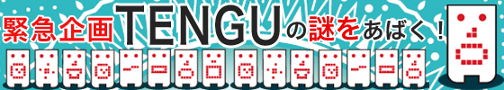
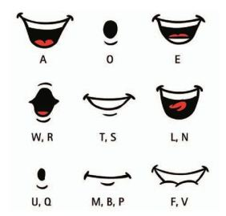

# led-face

[Pimoroni scroll hd phat](https://github.com/pimoroni/scroll-phat-hd)

[scroll hd docs](http://docs.pimoroni.com/scrollphathd/)

# Lip Sync

Ideally, you want the mouth to follow the shapes below as it speaks so it looks
like it is talking.

